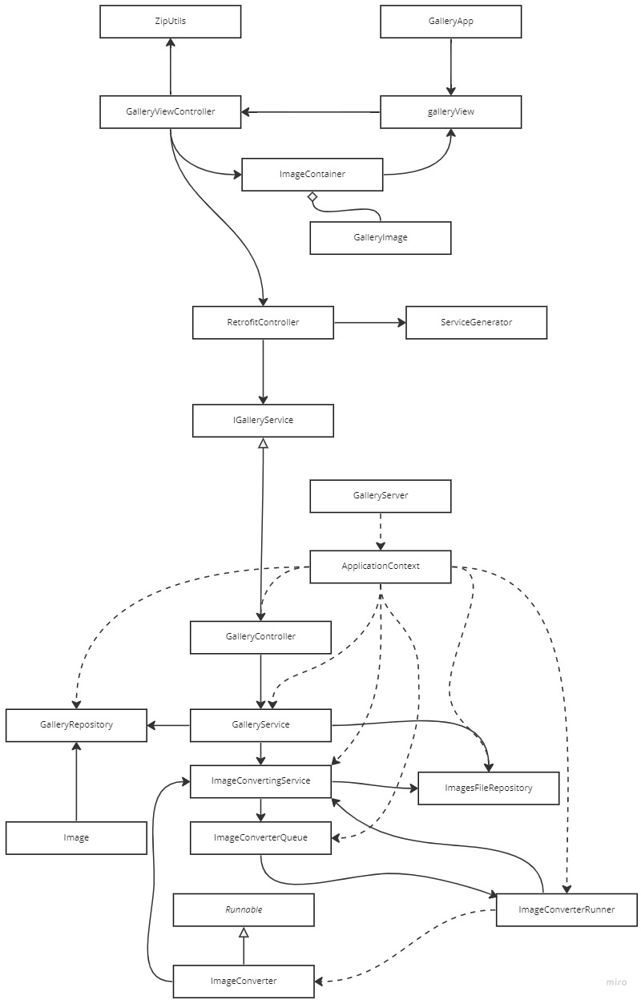
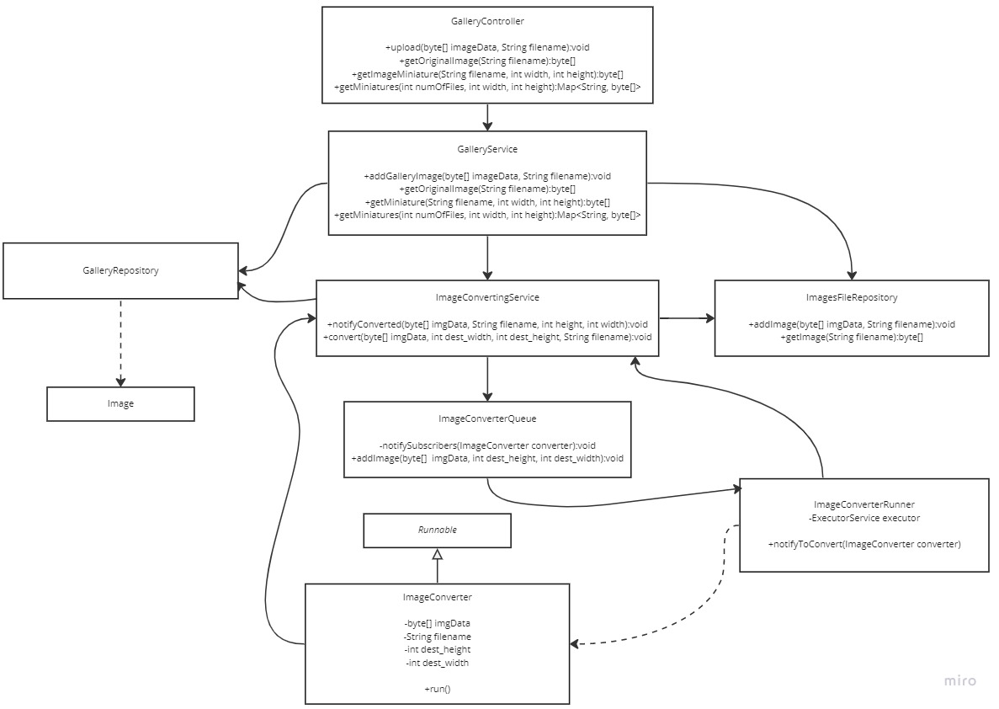

# Gallery app #
## Uruchomienie ##
1.Folder GalleryProject otwieramy za pomocą IntelliJ

2.W zakładce Services dodajemy i uruchamiamy serwis String Boot, klasa uruchomieniowa GalleryServer

3.Teraz równocześnie można odpalić aplikację z pliku konfiguracyjnego w folderze run (bezpośrednie odpalenie z klasy GalleryApp nie działa)

4.Obrazy dodajemy przez przeciągniecie paczki zip lub obrazów na przycisk upload

## Application architecture ##

## Backend schema ##

## Frontend schema ##
